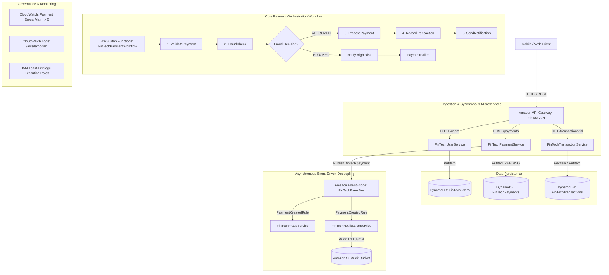

# Architecting a Serverless Microservices Platform for a High-Traffic FinTech Application on AWS

## 1. Problem Statement
Modern financial technology (FinTech) platforms face strict requirements for high availability, sub-second latency, rigorous regulatory auditing, and real-time fraud mitigation during peak traffic spikes (e.g., flash sales, bill payment cycles, salary disbursements). Traditional monolithic and container-managed server infrastructures often encounter:
- Resource over-provisioning during idle periods and costly infrastructure maintenance.
- Connection saturation and slow cold starts during sudden, massive traffic bursts.
- Tightly coupled transaction pipelines where failure in notification or fraud inspection cascades into transaction abandonment.
- Inadequate real-time auditability and non-compliance with statutory financial regulations.

This case study designs, implements, and evaluates a fully serverless, event-driven microservices architecture hosted on Amazon Web Services (AWS) in the `ap-south-1` (Mumbai) region.

---

## 2. Objectives
1. **Zero Server Maintenance**: Eliminate OS patching, capacity planning, and idle server costs using AWS managed serverless services.
2. **Decoupled Asynchronous Processing**: Employ an event-driven architecture using Amazon EventBridge to fan out payment notifications and fraud checks without blocking payment ingestion.
3. **Resilient Transaction Orchestration**: Implement AWS Step Functions (STANDARD workflow) to orchestrate multi-step payment lifecycles with state tracking, error handling, and automated failure branches.
4. **Predictable Scalability & Low Latency**: Implement API Gateway request throttling (Token Bucket algorithm: 100 req/s rate, 200 burst) and Lambda concurrency controls.
5. **Least-Privilege Security & Audit Compliance**: Enforce granular IAM policies and archive immutable audit trails in Amazon S3 with AES-256 server-side encryption.

---

## 3. Architecture

### End-to-End System Architecture



---

## 4. AWS Services Used

| AWS Service | Role in Architecture | Configuration / Details |
|---|---|---|
| **Amazon API Gateway** | API Management & Ingestion | Regional REST API (`FinTechAPI`), prod stage, rate limit 100 req/s, burst 200 |
| **AWS Lambda** | Serverless Compute Engine | 5 Microservices running Python 3.12 runtime, 128 MB RAM, 15s timeout |
| **Amazon DynamoDB** | NoSQL Data Persistence | `FinTechUsers`, `FinTechPayments`, `FinTechTransactions` (On-Demand `PAY_PER_REQUEST`) |
| **Amazon EventBridge** | Event Broker & Fan-Out | Custom event bus `FinTechEventBus`, rule `PaymentCreatedRule` |
| **AWS Step Functions** | Distributed Workflow Orchestration | Standard state machine `FinTechPaymentWorkflow` with decision branches |
| **Amazon S3** | Immutable Audit Trail Storage | `fintech-audit-storage-695694684182-ap-south-1` with AES-256 SSE |
| **Amazon CloudWatch** | Observability & Alerting | Centralized Lambda logging and `FinTechPaymentService-Errors-Alarm` metric alarm |
| **AWS IAM** | Identity & Access Management | `FinTechLambdaExecutionRole` and `FinTechStepFunctionsRole` with least privilege |

---

## 5. Microservices Specifications

### 1. `FinTechUserService`
- **Trigger**: API Gateway `POST /users`
- **Responsibility**: Onboards users, validates payload, and commits user profile to DynamoDB `FinTechUsers`.
- **Primary Attributes**: `userId` (Partition Key), `name`, `email`, `tier`, `createdAt`, `status`.

### 2. `FinTechPaymentService`
- **Trigger**: API Gateway `POST /payments`
- **Responsibility**: Initializes financial payment records in DynamoDB `FinTechPayments` with `PENDING` status and emits an asynchronous `PaymentCreated` event to `FinTechEventBus`.
- **Primary Attributes**: `paymentId` (Partition Key), `userId`, `amount`, `currency`, `recipientId`, `status`, `createdAt`.

### 3. `FinTechTransactionService`
- **Trigger**: API Gateway `GET /transactions/{transactionId}` & Step Functions `RecordTransaction`
- **Responsibility**: Provides read-after-write settlement ledger retrieval and updates transaction completion in `FinTechTransactions`.
- **Primary Attributes**: `transactionId` (Partition Key), `paymentId`, `userId`, `amount`, `status`, `timestamp`.

### 4. `FinTechFraudService`
- **Trigger**: EventBridge `PaymentCreatedRule` & Step Functions `FraudCheck`
- **Responsibility**: Executes risk scoring based on transaction limits:
  - **Amount < INR 50,000**: LOW risk (`fraudScore: 10`, `decision: APPROVED`)
  - **Amount INR 50,000 – 100,000**: MEDIUM risk (`fraudScore: 55`, `decision: FLAGGED_FOR_REVIEW`)
  - **Amount > INR 100,000**: HIGH risk (`fraudScore: 95`, `decision: BLOCKED`)

### 5. `FinTechNotificationService`
- **Trigger**: EventBridge `PaymentCreatedRule` & Step Functions `SendNotification`
- **Responsibility**: Dispatches multi-channel customer communications (SMS, Email, Push) and persists an immutable JSON audit log to the S3 audit bucket.

---

## 6. API Endpoints

**Base URL**: `https://kp88qpmac4.execute-api.ap-south-1.amazonaws.com/prod`

### 1. Create User
- **Method**: `POST`
- **Path**: `/users`
- **Request Body**:
  ```json
  {
    "userId": "usr_fintech_101",
    "name": "Aarav Sharma",
    "email": "aarav.sharma@fintech.test",
    "tier": "PREMIUM"
  }
  ```
- **Response** (`201 Created`):
  ```json
  {
    "message": "User created successfully",
    "user": {
      "userId": "usr_fintech_101",
      "name": "Aarav Sharma",
      "email": "aarav.sharma@fintech.test",
      "tier": "PREMIUM",
      "createdAt": "2026-10-05T16:55:57.761114+00:00",
      "status": "ACTIVE"
    }
  }
  ```

### 2. Initiate Payment
- **Method**: `POST`
- **Path**: `/payments`
- **Request Body**:
  ```json
  {
    "paymentId": "pay_test_25000",
    "userId": "usr_fintech_101",
    "amount": 25000,
    "currency": "INR",
    "recipientId": "merchant_flipkart"
  }
  ```
- **Response** (`201 Created`):
  ```json
  {
    "message": "Payment initiated successfully",
    "payment": {
      "paymentId": "pay_test_25000",
      "userId": "usr_fintech_101",
      "amount": "25000.0",
      "currency": "INR",
      "recipientId": "merchant_flipkart",
      "status": "PENDING",
      "createdAt": "2026-10-05T16:56:32.256513+00:00"
    },
    "eventBridgeEntries": [{ "EventId": "6ffe61c1-2f40-2057-3a2d-79f05e244f93" }]
  }
  ```

### 3. Retrieve Transaction
- **Method**: `GET`
- **Path**: `/transactions/{transactionId}`
- **Response** (`200 OK`):
  ```json
  {
    "transaction": {
      "transactionId": "txn_60a570dfa7",
      "paymentId": "pay_stepfn_normal",
      "userId": "usr_fintech_101",
      "amount": "18500",
      "status": "COMPLETED",
      "timestamp": "2026-10-05T16:58:38.597931+00:00",
      "details": "Settlement finalized and posted to ledger"
    }
  }
  ```

---

## 7. EventBridge Asynchronous Flow

1. When a payment is initiated via `FinTechPaymentService`, it writes a `PENDING` payment to DynamoDB.
2. Concurrently, it invokes `events:PutEvents` publishing to custom event bus `FinTechEventBus`:
   - **Source**: `fintech.payment`
   - **DetailType**: `PaymentCreated`
3. EventBridge rule `PaymentCreatedRule` matches the event pattern `{"source": ["fintech.payment"]}`.
4. The event is simultaneously fanned out to:
   - `FinTechFraudService`: Assesses fraud risk in real-time.
   - `FinTechNotificationService`: Dispatches customer alerts and archives an audit log to Amazon S3.

---

## 8. Step Functions Workflow Orchestration

The state machine `FinTechPaymentWorkflow` coordinates the synchronous settlement pipeline:

1. **`ValidatePayment`**: Validates input schema and account parameters.
2. **`FraudCheck`**: Invokes `FinTechFraudService` to compute a risk score.
3. **`CheckFraudDecision` (Choice State)**:
   - If `decision == "BLOCKED"`: Routes to `PaymentBlockedNotification` and terminates in `PaymentFailed` with `FraudHighRiskException`.
   - If `decision == "APPROVED"`: Advances to `ProcessPayment`.
4. **`ProcessPayment`**: Authorizes the payment transaction.
5. **`RecordTransaction`**: Invokes `FinTechTransactionService` to post ledger entries to DynamoDB `FinTechTransactions`.
6. **`SendNotification`**: Invokes `FinTechNotificationService` to send final confirmation.

---

## 9. Scalability & Performance Design

1. **API Gateway Throttling**:
   - Implemented Token Bucket algorithm at the `prod` stage level.
   - Steady-state rate: **100 requests/second**.
   - Burst limit: **200 concurrent requests**.
   - Protects downstream serverless microservices from Distributed Denial of Service (DDoS) or unpredicted flash traffic.
2. **DynamoDB On-Demand (`PAY_PER_REQUEST`)**:
   - Zero capacity planning; automatically accommodates dynamic spikes without partition throttling.
3. **Lambda Scalability & Versioning**:
   - Versioning enabled; published version `1` linked to alias `prod`.
   - Architectural pattern: Reserved Concurrency prevents single-service pool exhaustion; Provisioned Concurrency eliminates cold starts for latency-sensitive payment APIs.

---

## 10. Security & Least Privilege

1. **Granular IAM Policies**:
   - `FinTechLambdaExecutionRole`: Restricts DynamoDB access solely to the 3 application tables (`FinTechUsers`, `FinTechPayments`, `FinTechTransactions`), restricts EventBridge emission exclusively to `FinTechEventBus`, and restricts S3 writing to the audit bucket.
   - `FinTechStepFunctionsRole`: Grants execution permissions only over `FinTech*` Lambdas.
2. **At-Rest & In-Transit Encryption**:
   - All API Gateway traffic enforced over HTTPS (TLS 1.2+).
   - Amazon S3 bucket protected with AWS Server-Side Encryption (SSE-S3 AES-256).
   - DynamoDB tables encrypted at rest using AWS managed keys.

---

## 11. Fault Tolerance & Monitoring

1. **Decoupled Architecture**:
   - If notification or downstream reporting services experience degradation, the primary payment ingestion continues unaffected due to asynchronous EventBridge event buffering.
2. **Step Functions Redrive & Catch Blocks**:
   - Failed state transitions are isolated with structured error codes (`FraudHighRiskException`), preventing inconsistent database states.
3. **Amazon CloudWatch Monitoring & Alarm**:
   - Log groups created under `/aws/lambda/FinTech*`.
   - Metric Alarm `FinTechPaymentService-Errors-Alarm`: Triggers when `Errors > 5` over a 5-minute evaluation period (`AWS/Lambda` namespace, `Sum` statistic), alerting SRE teams to unexpected transaction failures.

---

## 12. Verification & Testing Results

| Test Case | Scenario / Payload | Expected Result | Actual Result | Status |
|---|---|---|---|---|
| **TC-01** | `POST /users` (Aarav Sharma) | HTTP 201, User saved in DynamoDB | HTTP 201, Item confirmed in `FinTechUsers` | **PASSED** |
| **TC-02** | `POST /payments` (INR 25,000) | HTTP 201, Event published to EventBridge | HTTP 201, EventId `6ffe61c1...` generated | **PASSED** |
| **TC-03** | DynamoDB Persistence Check | Payment record in `PENDING` state | Confirmed via `aws dynamodb get-item` | **PASSED** |
| **TC-04** | EventBridge Fan-Out | Fraud and Notification Lambdas triggered | CloudWatch logs confirm simultaneous execution | **PASSED** |
| **TC-05** | S3 Audit Storage | Audit JSON uploaded to S3 | Object `audit-logs/.../notif_917d06d059.json` created | **PASSED** |
| **TC-06** | Step Functions Normal Flow (INR 18,500) | State machine executes all 5 steps to SUCCEEDED | Execution SUCCEEDED in 1.47s, Transaction stored | **PASSED** |
| **TC-07** | `GET /transactions/{id}` | HTTP 200 returning stored transaction | HTTP 200 with matching transaction JSON | **PASSED** |
| **TC-08** | High-Risk Payment (INR 150,000) | Fraud score 95, `BLOCKED` status | Flagged `HIGH` risk, score 95, decision `BLOCKED` | **PASSED** |
| **TC-09** | Step Functions High-Risk Branch | Routes to blocked branch, terminates FAILED | State machine FAILED with `FraudHighRiskException` | **PASSED** |
| **TC-10** | CloudWatch Alarm State | Alarm configured with Threshold > 5 in 5m | Alarm `FinTechPaymentService-Errors-Alarm` verified (OK) | **PASSED** |

---

## 13. Syllabus Mapping (Curriculum Alignment)

This implementation directly satisfies core academic and industry learning outcomes:

1. **Cloud Computing & Architecture**:
   - Design of Multi-Tier Cloud Architectures (Presentation, Application, Persistence layers).
   - Serverless Computing Paradigms (FaaS vs. IaaS/PaaS).
   - Cloud Economics and Auto-Scaling models (`PAY_PER_REQUEST` vs. Provisioned).
2. **Distributed Systems**:
   - Event-Driven Architecture (EDA) and Publish-Subscribe Patterns (Amazon EventBridge).
   - Distributed Consensus, Idempotency, and Workflow Orchestration (AWS Step Functions).
   - Latency optimization and Throttling Algorithms (Token Bucket on API Gateway).
3. **Information Security & Governance**:
   - Principle of Least Privilege (PoLP) with Role-Based Access Control (RBAC).
   - At-Rest (AES-256) and In-Transit (TLS) cryptographic protection.
   - Statutory compliance through immutable audit trails.
